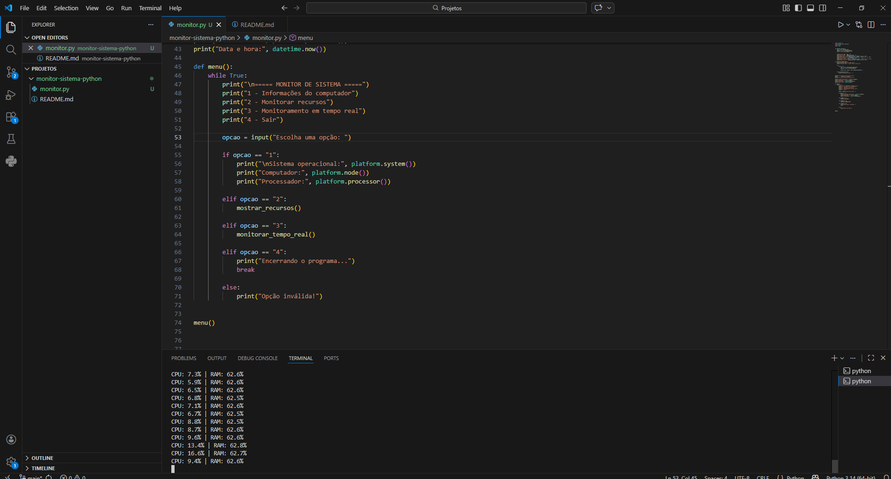

# Monitor de Sistema em Python

Projeto desenvolvido em Python para monitorar informações e recursos de um computador.

## Funcionalidades

- Exibe o sistema operacional
- Exibe o nome do computador
- Exibe informações do processador
- Exibe data e hora
- Monitora o uso da CPU
- Monitora o uso da memória RAM
- Mostra RAM total e disponível
- Monitora o uso do disco
- Mostra espaço total e disponível
- Monitoramento de CPU e RAM em tempo real
- Menu interativo

## Tecnologias utilizadas

- Python
- Psutil

## Requisitos

- Python 3.x
- Biblioteca psutil

## Instalação

Instale a biblioteca necessária:

```bash
## Demonstração

O programa também possui um modo de monitoramento em tempo real:



pip install psutil